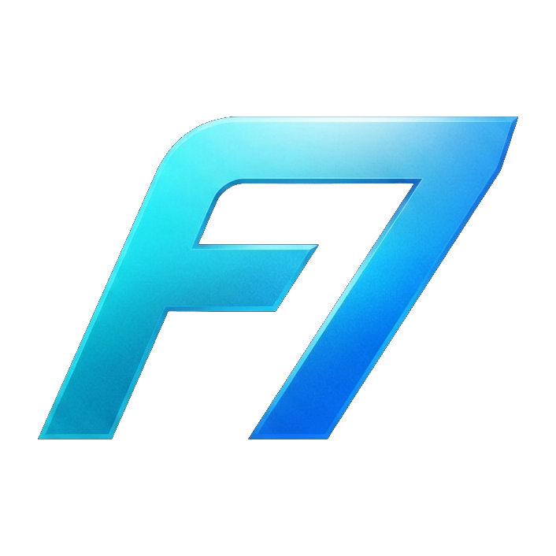

<div align="center">



# Fel7o — Music & Video Downloader

**Download • Organize • Enjoy**

[](https://github.com/Ahmed77khaled/Fel7o-Music-Downloader-import/releases)
[](https://github.com/Ahmed77khaled/Fel7o-Music-Downloader-import)
[](https://www.electronjs.org/)
[](LICENSE)

A production-ready Electron desktop app for Windows that lets you **download YouTube videos and music**, manage a download queue, and play your media — all in one place.

[📥 Download Installer](#installation) · [🚀 Run from Source](#development) · [📋 Changelog](CHANGELOG.md)

</div>

---

## ✨ Features

| Feature | Description |
|---|---|
| 🎵 **MP3 / Video Download** | Download audio (128/192/320 kbps) or video (480p → 4K) from YouTube |
| 📋 **Playlist Support** | Paste a playlist URL and select individual tracks to download |
| ⚡ **Concurrent Queue** | Run multiple downloads simultaneously with a configurable limit |
| ⏸ **Pause & Resume** | Pause, resume, or cancel any download individually or all at once |
| 🎬 **Built-in Media Player** | Play downloaded audio and video without leaving the app |
| ⏩ **Seek Support** | Instant seeking via the custom `media://` streaming protocol (HTTP 206) |
| 📁 **Download History** | Browse, search, and re-open all previously downloaded files |
| 🖥️ **Taskbar Controls** | Control playback from the Windows taskbar thumbnail toolbar |
| 🔔 **OS Notifications** | Get notified when downloads complete |
| 🔒 **Security-First** | Context isolation, sandboxed IPC, URL whitelisting, path traversal prevention |

---

## 📸 Screenshots

> _Screenshots will be added here._

---

## 📥 Installation

### Option A — Download the Installer (Recommended)

1. Go to [**Releases**](https://github.com/Ahmed77khaled/Fel7o-Music-Downloader-import/releases)
2. Download `Fel7o Setup x.x.x.exe`
3. Run the installer and follow the setup wizard

### Option B — Run from Source

See the [Development](#development) section below.

---

## 🛠️ Development

### Requirements

| Tool | Version |
|---|---|
| Node.js | 18 or later |
| npm | 9 or later |
| Windows | 10 / 11 (64-bit) |

> **Note:** `ffmpeg.exe` is extracted automatically from `bin/ffmpeg.zip` during `npm install` (via the `postinstall` script). `yt-dlp.exe` must be present in `bin/` for downloads to work.

### Setup

```bash
# 1. Clone the repository
git clone https://github.com/Ahmed77khaled/Fel7o-Music-Downloader-import.git
cd Fel7o-Music-Downloader-import

# 2. Install dependencies (also extracts ffmpeg automatically)
npm install

# 3. Launch the app
npm start
```

---

## 📦 Build

To build the production Windows installer:

```bash
npm run dist
```

Output is placed in the `release/` folder.  
Requires `bin/ffmpeg.exe` and `bin/yt-dlp.exe` to be present.

---

## 🗂️ Folder Structure

```
Fel7o-Music-Downloader-import/
│
├── main.js              # Electron main process
├── preload.js           # IPC bridge (contextBridge)
├── renderer.js          # UI logic and state management
├── index.html           # Main app window
├── home.html            # Home screen
├── history.html         # History screen
├── styles.css           # All application styles
├── Fel7o.js             # App launcher (npm start entry)
│
├── assets/              # Icons and images
├── bin/                 # Bundled binaries
│   ├── ffmpeg.zip       # FFmpeg archive (auto-extracted on npm install)
│   └── yt-dlp.exe       # yt-dlp binary
├── shared/              # Shared utilities (main + renderer)
│   ├── shared-utils.js
│   └── global-bg.js
├── scripts/             # Build and setup scripts
│   └── extract-ffmpeg.js
└── docs/                # Technical documentation
```

---

## ⚙️ Technologies

- **[Electron](https://www.electronjs.org/)** v31 — Desktop runtime
- **[yt-dlp](https://github.com/yt-dlp/yt-dlp)** — YouTube download engine
- **[FFmpeg](https://ffmpeg.org/)** — Audio/video processing
- **Vanilla JavaScript** — Zero framework dependencies in runtime
- **[electron-builder](https://www.electron.build/)** — NSIS Windows installer packaging

---

## 📋 Requirements

- Windows 10 or 11 (64-bit)
- Active internet connection (for downloading)
- `bin/yt-dlp.exe` (bundled)
- `bin/ffmpeg.exe` (auto-extracted from `bin/ffmpeg.zip` on `npm install`)

---

## 📄 Documentation

Full technical documentation is in the [`docs/`](docs/) folder:

- [Architecture](docs/ARCHITECTURE.md)
- [Engineering Report](docs/Engineering_Report_v5.0.1.md)
- [Changelog](docs/CHANGELOG.md)
- [Release Notes](docs/RELEASE_NOTES_v5.0.1.md)
- [Security](docs/SECURITY.md)
- [Roadmap](docs/ROADMAP.md)
- [Known Issues](docs/KNOWN_ISSUES.md)

---

## 📜 License

[MIT](LICENSE) © 2026 Ahmed Khaled Elfalah
